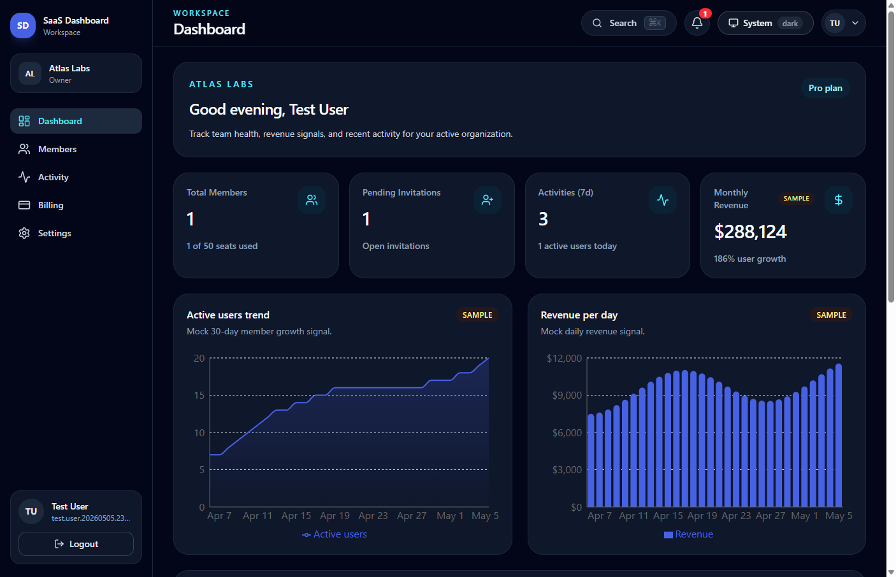
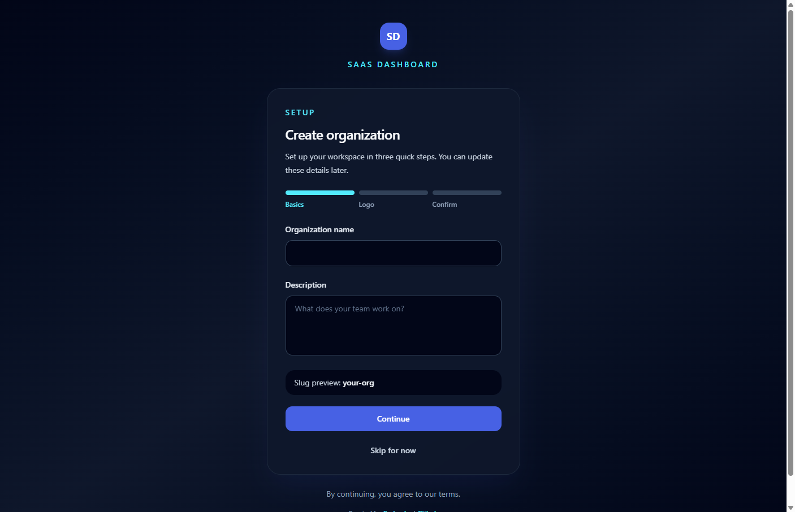
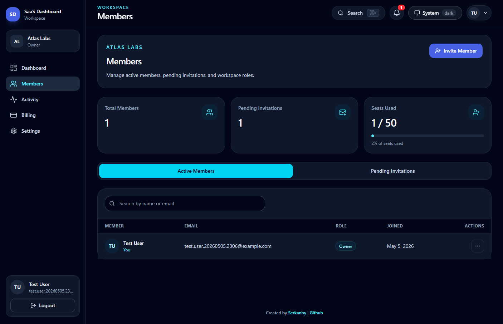
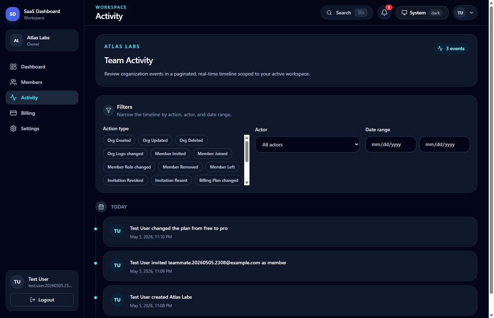
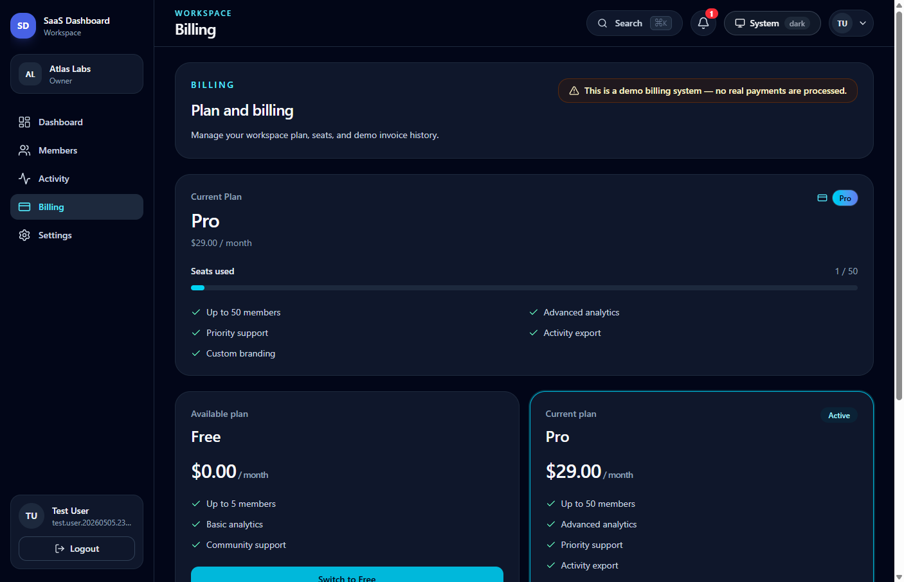
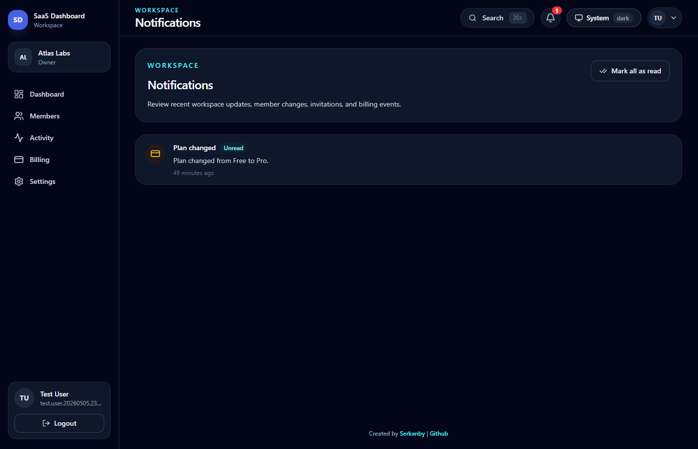
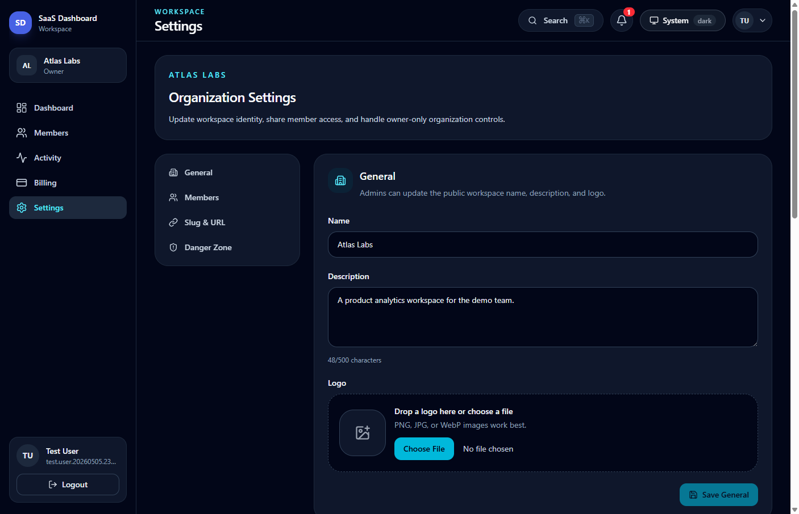
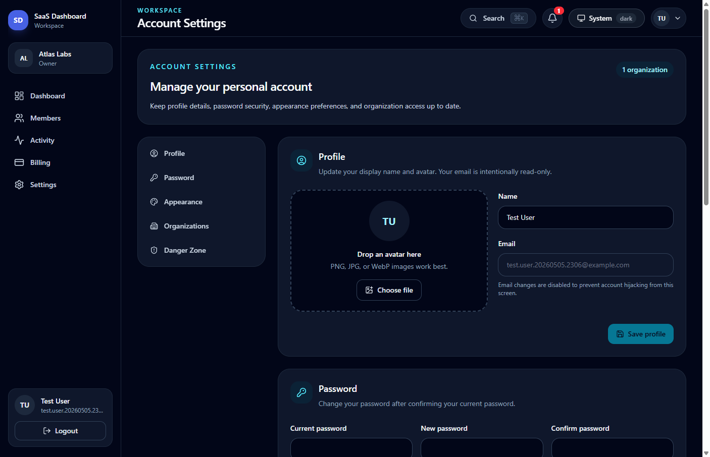
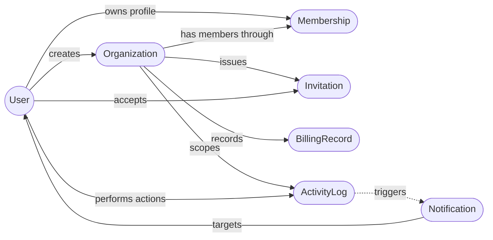
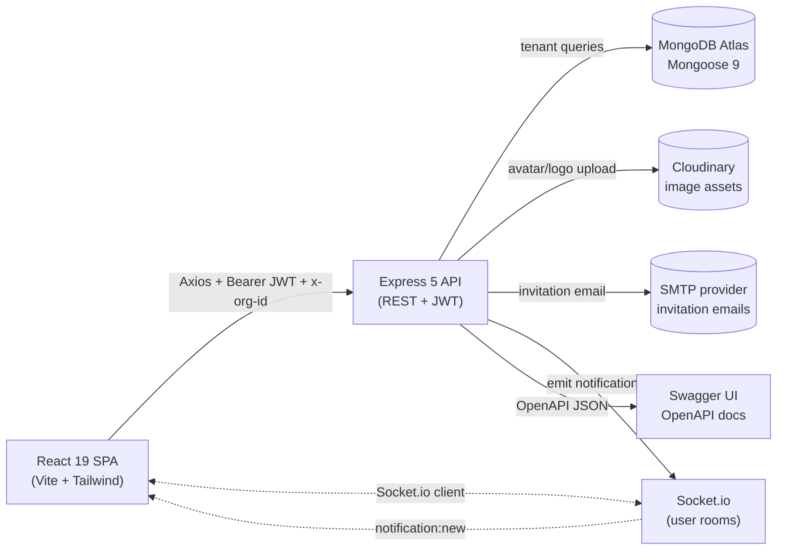

<div align="center">
  <p>
    <strong>SaaS Dashboard</strong>
  </p>

  <h1>SaaS Dashboard Template</h1>

  <p><em>A full-stack multi-tenant SaaS dashboard with organizations, RBAC, invitations, mock billing, real-time notifications, analytics, and a modern MERN-style architecture.</em></p>

  <p>
    
    
    
    
    
    
    
    
    
  </p>

  <p>
    <a href="https://saas-dashboard-template.netlify.app/">Live Demo</a> •
    <a href="#features">Features</a> •
    <a href="#installation">Quick Start</a> •
    <a href="#api-endpoints">API Docs</a> •
    <a href="#screenshots">Screenshots</a>
  </p>

  <a href="https://saas-dashboard-template.netlify.app/">
    
  </a>
</div>

---

## Features

- **Multi-tenant organizations**: Users can create, switch, update, and manage multiple workspaces through isolated organization records.
- **Role-based access control**: Owner, admin, member, and super admin flows are enforced by reusable permission middleware and protected React routes.
- **Invitation workflow**: Admins can invite teammates, resend or revoke pending invitations, preview invite tokens, and accept invitations after authentication.
- **Workspace dashboard**: KPI cards and Recharts visualizations track members, seats, activity, revenue signals, and growth.
- **Mock billing system**: Free and Pro plans, seat limits, billing history, and invoice lookup model a subscription workflow without real payment processing.
- **Real-time notifications**: Socket.io delivers user-scoped notifications for workspace events and membership changes.
- **Activity timeline**: Tenant-scoped audit logs can be filtered by action, actor, and date range.
- **Global search**: A command palette searches members, invitations, activities, and billing records inside the active organization.
- **Super admin console**: Platform-level pages manage organizations, users, suspensions, restores, and destructive admin actions.
- **Secure file uploads**: Avatar and organization logo uploads are handled server-side with Multer and Cloudinary.
- **Responsive dark UI**: React 19, Tailwind CSS 4, theme persistence, accessible shared components, and lazy-loaded pages keep the UI fast and consistent.
- **Documented API**: Swagger/OpenAPI docs are available in development and can be explicitly enabled in production.

---

## Live Demo

[🚀 View Live Demo](https://saas-dashboard-template.netlify.app/)

The deployed frontend runs on Netlify and connects to the deployed API configured through `VITE_API_URL`.

---

## Screenshots

All screenshots are captured from the [live deployment](https://saas-dashboard-template.netlify.app/) running against the seeded demo dataset.

<table>
  <tr>
    <td align="center" width="33%">
      <a href="./assets/screenshots/create-org.png"></a>
      <sub><b>Onboarding</b><br/>Workspace creation wizard</sub>
    </td>
    <td align="center" width="33%">
      <a href="./assets/screenshots/dashboard.png"></a>
      <sub><b>Dashboard</b><br/>KPIs, charts, and activity</sub>
    </td>
    <td align="center" width="33%">
      <a href="./assets/screenshots/members.png"></a>
      <sub><b>Members</b><br/>Roles, invites, and seats</sub>
    </td>
  </tr>
  <tr>
    <td align="center" width="33%">
      <a href="./assets/screenshots/activity.png"></a>
      <sub><b>Activity</b><br/>Filtered workspace timeline</sub>
    </td>
    <td align="center" width="33%">
      <a href="./assets/screenshots/billing.png"></a>
      <sub><b>Billing</b><br/>Plans, seats, and invoices</sub>
    </td>
    <td align="center" width="33%">
      <a href="./assets/screenshots/notifications.png"></a>
      <sub><b>Notifications</b><br/>Workspace update inbox</sub>
    </td>
  </tr>
  <tr>
    <td align="center" width="33%">
      <a href="./assets/screenshots/organization-settings.png"></a>
      <sub><b>Organization</b><br/>Branding and owner controls</sub>
    </td>
    <td align="center" width="33%">
      <a href="./assets/screenshots/account-settings.png"></a>
      <sub><b>Account</b><br/>Profile, password, and theme</sub>
    </td>
    <td align="center" width="33%">
      <a href="./assets/screenshots/super-admin-dashboard.png"></a>
      <sub><b>Admin</b><br/>Platform metrics and oversight</sub>
    </td>
  </tr>
</table>

> Bonus operator views - `super-admin-organizations.png` and `super-admin-users.png` - also live in `assets/screenshots/` for reference.

---

## Architecture

A high-level visual map of the system. Both diagrams render natively on GitHub thanks to Mermaid support.

### Domain Model

How the core collections relate to each other across tenant, billing, invitation, activity, and notification flows.



### Request Lifecycle

How an authenticated browser action travels through the stack and returns tenant-scoped data.



---

## Technologies

### Frontend

- **React 19**: Modern UI library with hooks, context providers, lazy routes, and resilient error boundaries.
- **Vite 8**: Fast development server and optimized production bundling.
- **React Router DOM 7**: Nested route layouts, protected route guards, guest-only routes, and super admin routing.
- **Tailwind CSS 4**: Utility-first styling system for the responsive dark-first dashboard UI.
- **Axios 1**: API client with JWT and `x-org-id` request interceptors.
- **Socket.io Client 4**: Real-time notification transport.
- **Recharts 3**: Dashboard, revenue, activity, and platform analytics charts.
- **Lucide React**: Consistent icon set for navigation, actions, and empty states.
- **React Hot Toast**: Lightweight toast notifications for form and async feedback.
- **Vitest and Testing Library**: Client-side component and route behavior tests.

### Backend

- **Node.js 20+**: Server runtime for the Express API.
- **Express 5**: REST API framework with modular routes, middleware, and centralized error handling.
- **MongoDB with Mongoose 9**: Document database and ODM for users, organizations, memberships, invitations, billing records, activity logs, and notifications.
- **JWT**: Stateless bearer authentication for API requests and Socket.io handshakes.
- **bcryptjs**: Password hashing and password confirmation checks.
- **Socket.io 4**: Real-time server for per-user notification delivery.
- **Nodemailer**: SMTP invitation email delivery and local email preview scripts.
- **Cloudinary and Multer**: Server-side image upload pipeline for avatars and organization logos.
- **Helmet, CORS, rate limiting, and sanitization**: Security middleware for HTTP hardening and abuse reduction.
- **Swagger UI Express and swagger-jsdoc**: OpenAPI documentation from route annotations.
- **Pino**: Structured request and application logging.
- **Vitest, Supertest, and mongodb-memory-server**: Backend integration tests without a real test database.

---

## Installation

### Prerequisites

- **Node.js** v20+ and **npm**
- **MongoDB** Atlas cluster or local MongoDB instance
- **Cloudinary** account for avatar and organization logo uploads
- **SMTP credentials** such as Mailtrap, Resend, Postmark, SendGrid, or another provider for invitation emails

### Local Development

**1. Clone the repository:**

```bash
git clone https://github.com/Serkanbyx/s4.18_SaaS-Dashboard-Template.git
cd s4.18_SaaS-Dashboard-Template
```

**2. Set up environment variables:**

```bash
cp server/.env.example server/.env
cp client/.env.example client/.env
```

**server/.env**

```env
PORT=5000
NODE_ENV=development
MONGO_URI=your_mongodb_connection_string
JWT_SECRET=replace_this_with_a_long_random_secret_32_chars_min
JWT_EXPIRES_IN=7d
CLIENT_URL=http://localhost:5173
CLOUDINARY_CLOUD_NAME=your_cloudinary_cloud_name
CLOUDINARY_API_KEY=your_cloudinary_api_key
CLOUDINARY_API_SECRET=your_cloudinary_api_secret
EMAIL_HOST=smtp.example.com
EMAIL_PORT=587
EMAIL_USER=your_smtp_user
EMAIL_PASS=your_smtp_password
EMAIL_FROM="SaaS Dashboard <sender@example.test>"
LOG_LEVEL=debug
EXPOSE_DOCS_IN_PROD=false
SUPER_ADMIN_EMAIL=super-admin@example.test
SUPER_ADMIN_PASSWORD=replace_this_with_a_strong_temporary_password
```

**client/.env**

```env
VITE_API_URL=http://localhost:5000/api
```

**Environment variable reference:**

| Variable | App | Description |
| --- | --- | --- |
| `PORT` | Server | API port. Defaults to `5000`. |
| `NODE_ENV` | Server | Runtime mode: `development`, `test`, or `production`. |
| `MONGO_URI` | Server | MongoDB connection string. |
| `JWT_SECRET` | Server | JWT signing secret. Use at least 32 characters in production. |
| `JWT_EXPIRES_IN` | Server | JWT lifetime, for example `7d`. |
| `CLIENT_URL` | Server | Frontend origin for CORS and invitation links. |
| `CLOUDINARY_CLOUD_NAME` | Server | Cloudinary cloud name. |
| `CLOUDINARY_API_KEY` | Server | Cloudinary API key. |
| `CLOUDINARY_API_SECRET` | Server | Cloudinary API secret. |
| `EMAIL_HOST` | Server | SMTP host for invitation email delivery. |
| `EMAIL_PORT` | Server | SMTP port, usually `587`. |
| `EMAIL_USER` | Server | SMTP username. |
| `EMAIL_PASS` | Server | SMTP password or provider token. |
| `EMAIL_FROM` | Server | Sender identity for outgoing emails. |
| `LOG_LEVEL` | Server | Pino log level such as `debug`, `info`, or `warn`. |
| `EXPOSE_DOCS_IN_PROD` | Server | Set to `true` only when public Swagger docs are intentional. |
| `SUPER_ADMIN_EMAIL` | Server | Email used by the super admin seed script. |
| `SUPER_ADMIN_PASSWORD` | Server | Temporary seed password. Rotate after seeding. |
| `VITE_API_URL` | Client | API base URL, ending with `/api`. |

**3. Install dependencies:**

```bash
cd server
npm install

cd ../client
npm install
```

**4. Seed the super admin user:**

```bash
cd server
npm run seed:admin
```

**5. Run the application:**

```bash
# Terminal 1 - Backend
cd server
npm run dev

# Terminal 2 - Frontend
cd client
npm run dev
```

Open `http://localhost:5173` in your browser. The API runs on `http://localhost:5000` by default.

---

## Usage

1. Register a new account or log in with a seeded account.
2. Create an organization from the onboarding flow.
3. Use the organization switcher to choose the active tenant context.
4. Review dashboard metrics, charts, and recent activity.
5. Invite teammates from the Members page and manage their roles based on your permissions.
6. Review activity logs, mock billing plans, notification state, and organization settings.
7. Open the account settings page to update profile, password, theme, and organization access.
8. Sign in as a seeded super admin to access `/super-admin` and manage platform-level organizations and users.
9. Log out from the sidebar when finished.

---

## How It Works?

### Authentication Flow

The backend registers or logs in users, hashes passwords with `bcryptjs`, signs JWTs, and protects private routes with the `protect` middleware. The frontend stores the token locally and sends it through the shared Axios instance.

```javascript
api.interceptors.request.use((config) => {
  const token = localStorage.getItem('saas:token');
  const orgId = localStorage.getItem('saas:activeOrgId');

  if (token) {
    config.headers.Authorization = `Bearer ${token}`;
  }

  if (orgId) {
    config.headers['x-org-id'] = orgId;
  }

  return config;
});
```

### Tenant Data Flow

Organization-scoped requests include `x-org-id`. The tenant middleware validates the organization, verifies the current user's membership, and attaches `req.org`, `req.orgId`, and `req.membership` before controllers run.

```javascript
const orgId = req.params.orgId || req.query.orgId || req.headers['x-org-id'];
const org = await Organization.findOne({ _id: orgId, isDeleted: false });
const membership = await Membership.findOne({ userId: req.user._id, orgId: org._id });

req.org = org;
req.orgId = org._id;
req.membership = membership;
```

### Permission Flow

Reusable permission middleware maps actions to allowed organization roles. The client mirrors these rules with protected route components so restricted pages do not appear to unauthorized users.

```javascript
export const PERMISSIONS = {
  'org:billing': ['owner'],
  'members:invite': ['owner', 'admin'],
  'members:read': ['owner', 'admin', 'member'],
  'activity:read': ['owner', 'admin', 'member'],
};
```

### Invitation Flow

Admins create invitations through the API, the server generates a UUID token, sends a branded email, and exposes a token preview endpoint. Recipients authenticate, accept the invite, and receive membership in the target organization.

```text
POST /api/invitations
  -> create token
  -> send invitation email
  -> recipient opens /invite/accept?token=...
  -> POST /api/invitations/accept
  -> create membership
  -> log activity and notify users
```

### Real-Time Flow

Socket.io initializes with the HTTP server. Notification services can emit tenant or user events, and the React app subscribes through `SocketProvider` and notification hooks.

---

## API Endpoints

Swagger UI is available at `http://localhost:5000/api/docs` in development. The OpenAPI JSON document is available at `http://localhost:5000/api/docs.json`.

| Method | Endpoint | Auth | Description |
| --- | --- | --- | --- |
| `GET` | `/api/health` | No | Check API health status. |
| `POST` | `/api/auth/register` | No | Create a new user account. |
| `POST` | `/api/auth/login` | No | Log in and receive a JWT. |
| `GET` | `/api/auth/me` | Yes | Get the current authenticated user. |
| `PATCH` | `/api/auth/me` | Yes | Update profile name or avatar. |
| `PATCH` | `/api/auth/me/password` | Yes | Change the current user's password. |
| `POST` | `/api/auth/me/complete-onboarding` | Yes | Mark onboarding as completed. |
| `DELETE` | `/api/auth/me` | Yes | Delete the current user account. |
| `POST` | `/api/organizations` | Yes | Create an organization. |
| `GET` | `/api/organizations/mine` | Yes | List organizations for the current user. |
| `GET` | `/api/organizations/:orgId` | Yes | Get organization details. |
| `PATCH` | `/api/organizations/:orgId` | Yes | Update organization settings. |
| `DELETE` | `/api/organizations/:orgId` | Yes | Delete an organization. |
| `GET` | `/api/memberships` | Yes | List members for the active organization. |
| `GET` | `/api/memberships/overview` | Yes | Get members and pending invitation summary. |
| `DELETE` | `/api/memberships/me` | Yes | Leave the current organization. |
| `PATCH` | `/api/memberships/:membershipId` | Yes | Update a member role. |
| `DELETE` | `/api/memberships/:membershipId` | Yes | Remove a member. |
| `POST` | `/api/memberships/:membershipId/transfer-ownership` | Yes | Transfer organization ownership. |
| `POST` | `/api/invitations` | Yes | Invite a user to the active organization. |
| `GET` | `/api/invitations` | Yes | List organization invitations. |
| `GET` | `/api/invitations/by-token/:token` | No | Preview invitation details by token. |
| `POST` | `/api/invitations/accept` | Yes | Accept an invitation. |
| `DELETE` | `/api/invitations/:invitationId` | Yes | Revoke a pending invitation. |
| `POST` | `/api/invitations/:invitationId/resend` | Yes | Resend an invitation email. |
| `GET` | `/api/activities` | Yes | List activity logs with filters. |
| `GET` | `/api/activities/stats` | Yes | Get activity statistics. |
| `GET` | `/api/billing/plan` | Yes | Get the current organization plan. |
| `POST` | `/api/billing/plan/change` | Yes | Change the mock billing plan. |
| `GET` | `/api/billing/history` | Yes | List billing history. |
| `GET` | `/api/billing/invoice/:invoiceNumber` | Yes | Get invoice details. |
| `GET` | `/api/notifications` | Yes | List notifications for the current user. |
| `GET` | `/api/notifications/unread-count` | Yes | Get unread notification count. |
| `PATCH` | `/api/notifications/read-all` | Yes | Mark all notifications as read. |
| `PATCH` | `/api/notifications/:id/read` | Yes | Mark one notification as read. |
| `DELETE` | `/api/notifications/:id` | Yes | Delete one notification. |
| `GET` | `/api/dashboard/overview` | Yes | Get workspace dashboard KPIs. |
| `GET` | `/api/dashboard/charts/activity` | Yes | Get activity chart data. |
| `GET` | `/api/dashboard/charts/growth` | Yes | Get growth chart data. |
| `GET` | `/api/dashboard/charts/revenue` | Yes | Get revenue chart data. |
| `GET` | `/api/search` | Yes | Search tenant-scoped resources. |
| `POST` | `/api/uploads/avatar` | Yes | Upload a user avatar image. |
| `POST` | `/api/uploads/org-logo` | Yes | Upload an organization logo image. |
| `GET` | `/api/super-admin/stats` | Yes | Get platform statistics. |
| `GET` | `/api/super-admin/orgs` | Yes | List all organizations. |
| `GET` | `/api/super-admin/orgs/:orgId` | Yes | Get organization details as super admin. |
| `PATCH` | `/api/super-admin/orgs/:orgId/suspend` | Yes | Suspend an organization. |
| `PATCH` | `/api/super-admin/orgs/:orgId/restore` | Yes | Restore a suspended organization. |
| `DELETE` | `/api/super-admin/orgs/:orgId` | Yes | Permanently delete an organization. |
| `GET` | `/api/super-admin/users` | Yes | List all users. |
| `GET` | `/api/super-admin/users/:userId/memberships` | Yes | List a user's memberships. |
| `PATCH` | `/api/super-admin/users/:userId` | Yes | Update a user's active status. |

> Authenticated endpoints require `Authorization: Bearer <token>`. Organization-scoped endpoints also require `x-org-id: <organizationId>`. Rate limiters protect auth, invitations, uploads, search, global API traffic, and super admin routes.

---

## Project Structure

A clean monorepo layout with an explicit backend / frontend split. Each panel below is collapsible - expand the one you care about.

<details open>
<summary><b>Server</b> - Express 5 API</summary>

```
server/
├── config/          # env, db, logger, cloudinary, swagger
├── controllers/     # auth, orgs, members, invites, billing, admin
├── middleware/      # auth, tenant, rbac, rateLimit, sanitize, upload
├── models/          # User, Organization, Membership, Invitation, logs
├── routes/          # REST route modules with OpenAPI annotations
├── scripts/         # email preview and local utilities
├── seed/            # super admin seed script
├── services/        # activity, email, notification, socket services
├── tests/           # Vitest + Supertest integration suites
├── utils/           # constants, async handlers, app errors
├── validators/      # express-validator schemas
├── index.js         # Express, Socket.io, Swagger, and startup
├── .env.example
├── package-lock.json
└── package.json
```

</details>

<details>
<summary><b>Client</b> - React 19 + Vite SPA</summary>

```
client/
├── public/          # static public assets
├── src/
│   ├── api/         # Axios instance and interceptors
│   ├── components/  # common UI, layout, dashboard, members, onboarding
│   ├── context/     # Auth, Org, Socket, Notification, Theme providers
│   ├── hooks/       # reusable React hooks
│   ├── layouts/     # auth, organization, and super admin shells
│   ├── pages/       # route-level pages
│   ├── routes/      # protected, guest, role, and super admin guards
│   ├── services/    # API service wrappers
│   ├── tests/       # Vitest + Testing Library tests
│   ├── utils/       # permissions, formatters, lazy retry helper
│   ├── App.jsx      # router and provider composition
│   ├── index.css    # Tailwind CSS 4 entrypoint
│   └── main.jsx     # React entry point
├── .env.example
├── package-lock.json
└── package.json
```

</details>

<details>
<summary><b>Repository root</b> - docs, governance & shared assets</summary>

```
s4.18_SaaS-Dashboard-Template/
├── .github/         # issue templates, PR template, governance docs
├── assets/          # README screenshots and shared visual assets
├── client/          # React frontend app
├── docs/            # archived build guide
├── server/          # Express API app
├── .gitignore
├── LICENSE
└── README.md
```

</details>

---

## Security

- **HTTP hardening**: `helmet` sets common secure headers and Express disables `x-powered-by`.
- **CORS allowlist**: The API only accepts browser requests from `CLIENT_URL`.
- **Payload limits**: JSON and URL-encoded bodies are limited to `10kb` to reduce abuse.
- **Input sanitization**: Request data is sanitized before reaching route handlers.
- **JWT authentication**: Protected routes require bearer tokens signed by the server.
- **Password hashing**: Passwords are stored with bcrypt hashes, never as plain text.
- **Tenant isolation**: Organization data access requires a valid `x-org-id` and membership check.
- **RBAC permissions**: Role and permission middleware protects owner, admin, member, and super admin actions.
- **Rate limiting**: Auth, invite, upload, search, global API, and super admin routes have focused abuse controls.
- **Upload validation**: Avatar and logo uploads use dedicated Multer middleware and server-side Cloudinary uploads.
- **Production env checks**: Required production environment variables are validated during startup.
- **Docs visibility control**: Swagger docs are hidden in production unless `EXPOSE_DOCS_IN_PROD=true`.

---

## Deployment

### Backend on Render

1. Create a new Render Web Service from this repository.
2. Set the root directory to `server`.
3. Use `npm install` as the build command.
4. Use `npm start` as the start command.
5. Add production values from `server/.env.example`.
6. Point `MONGO_URI` to MongoDB Atlas.
7. Set `CLIENT_URL` to the Netlify site URL.
8. Keep `EXPOSE_DOCS_IN_PROD=false` unless public API docs are intentional.

| Variable | Value |
| --- | --- |
| `NODE_ENV` | `production` |
| `PORT` | Render-provided or `5000` |
| `MONGO_URI` | MongoDB Atlas connection string |
| `JWT_SECRET` | Long random production secret |
| `CLIENT_URL` | `https://saas-dashboard-template.netlify.app` |
| `CLOUDINARY_*` | Production Cloudinary credentials |
| `EMAIL_*` | Production SMTP credentials |
| `EXPOSE_DOCS_IN_PROD` | `false` |

> Seed the super admin once with `npm run seed:admin`, then rotate the seeded password.

### Frontend on Netlify

1. Create a new Netlify site from this repository.
2. Set the base directory to `client`.
3. Use `npm run build` as the build command.
4. Use `dist` as the publish directory.
5. Set `VITE_API_URL` to the deployed API URL ending with `/api`.

| Variable | Value |
| --- | --- |
| `VITE_API_URL` | `https://your-render-api.onrender.com/api` |

> If deep links return 404 on refresh, add a Netlify SPA redirect rule for `/* -> /index.html`.

### MongoDB Atlas

1. Create a cluster and database user.
2. Configure network access for your deployment provider.
3. Store the connection string in `MONGO_URI`.
4. Use a separate database for production and testing.

### Cloudinary

1. Create a Cloudinary account.
2. Copy cloud name, API key, and API secret into the server environment.
3. Keep uploads server-signed and validate file type and size before upload.

---

## Features in Detail

### Completed Features

- ✅ User registration, login, JWT sessions, profile updates, password changes, and account deletion
- ✅ Organization creation, switching, updates, slug URLs, ownership transfer, and deletion controls
- ✅ Owner, admin, member, and super admin permission model
- ✅ Invitation create, list, preview, accept, resend, and revoke flows
- ✅ Workspace dashboard KPIs and analytics charts
- ✅ Activity logs with action, actor, and date filters
- ✅ Mock billing plans, seat usage, billing history, and invoice lookup
- ✅ Real-time notification infrastructure with Socket.io
- ✅ Cloudinary avatar and organization logo uploads
- ✅ Super admin platform dashboard, organization management, and user management
- ✅ Client and server tests with Vitest
- ✅ Swagger API documentation in development

### Future Features

- [ ] Integrate a real billing provider such as Stripe, Paddle, or Lemon Squeezy
- [ ] Add organization-scoped audit export
- [ ] Add email verification and password reset flows
- [ ] Add advanced invite role templates
- [ ] Add CI badge once the repository workflow URL is public
- [ ] Add richer seeded demo content for larger screenshots

---

## Contributing

1. Fork the repository.
2. Create a focused feature branch.
3. Use clean, reusable code and keep changes scoped.
4. Run server and client tests before opening a pull request.
5. Document new environment variables, routes, and setup steps.
6. Push your branch and open a pull request.

| Prefix | Description |
| --- | --- |
| `feat:` | New feature |
| `fix:` | Bug fix |
| `refactor:` | Code refactoring |
| `docs:` | Documentation changes |
| `chore:` | Maintenance and dependency updates |

---

## License

This project is licensed under the [MIT License](LICENSE).

---

## Developer

**Serkanby**

- Website: [serkanbayraktar.com](https://serkanbayraktar.com/)
- GitHub: [@Serkanbyx](https://github.com/Serkanbyx)
- Email: [serkanbyx1@gmail.com](mailto:serkanbyx1@gmail.com)

---

## Acknowledgments

- [React](https://react.dev/) for the frontend component model
- [Express](https://expressjs.com/) for the backend REST API foundation
- [MongoDB](https://www.mongodb.com/) and [Mongoose](https://mongoosejs.com/) for document data modeling
- [Tailwind CSS](https://tailwindcss.com/) for the styling system
- [Socket.io](https://socket.io/) for real-time event delivery
- [Render](https://render.com/) and [Netlify](https://www.netlify.com/) for deployment workflows

---

## Contact

- Issue tracker: [Open an issue](https://github.com/Serkanbyx/s4.18_SaaS-Dashboard-Template/issues)
- Email: [serkanbyx1@gmail.com](mailto:serkanbyx1@gmail.com)
- Website: [serkanbayraktar.com](https://serkanbayraktar.com/)

---

⭐ If you like this project, don't forget to give it a star!
